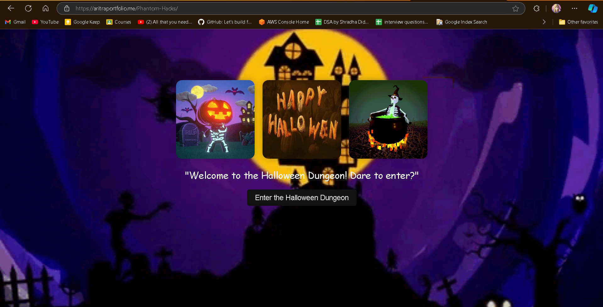
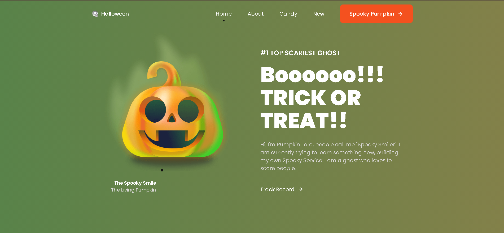
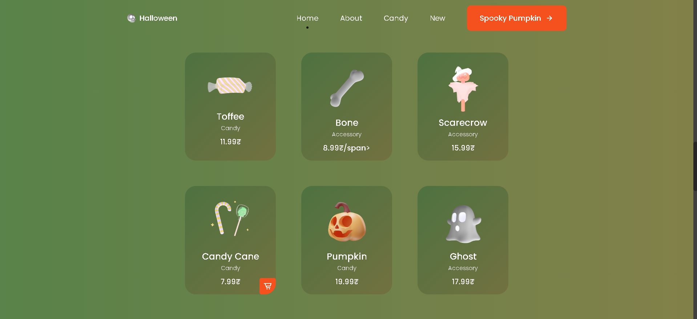
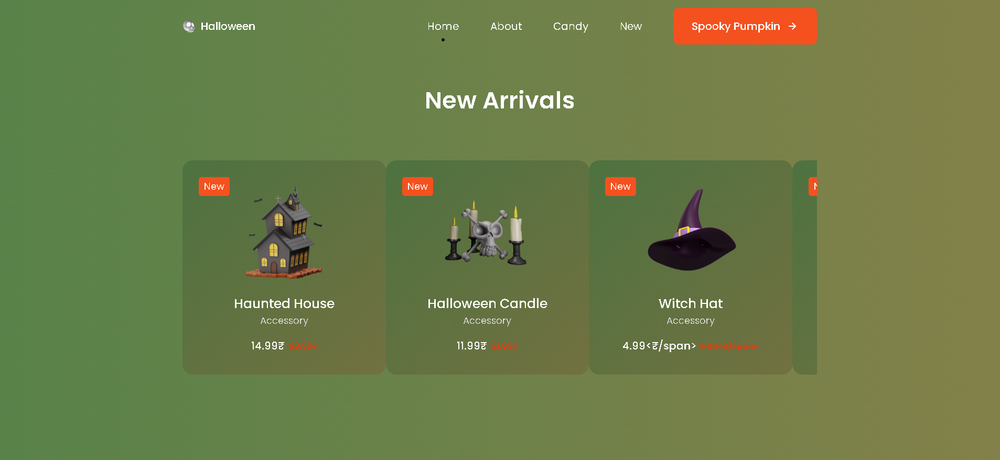
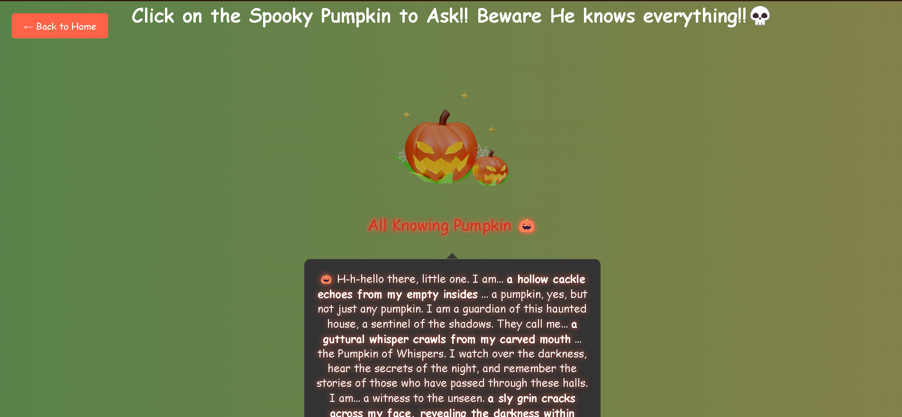

# 🎃 Halloween Spooky Website 👻

Welcome to my **Halloween Spooky Website**! This project is a fun and interactive web experience built using **HTML**, **CSS/SCSS**, **JavaScript**, and incorporates a spooky atmosphere to celebrate the Halloween spirit. The website includes a loader page, a dynamic home page with animations, and a **Spooky Pumpkin AI** powered by the **Gemini API**.

## 🕸️ Features

### 1. **Loader Page**
- A custom Halloween-themed loader animation to enhance the initial user experience.
- The loader displays eerie elements like a floating ghost and spooky text, setting the stage for the rest of the website.
  


### 2. **Home Page**
- The home page greets users with a **floating ghost animation** and Halloween-themed design elements.
- **Ghost-Themed Custom Cursor**: The mouse pointer is transformed into a ghost icon, adding to the creepy atmosphere.
- **Interactive Spooky Cards**: Clicking on these cards triggers pop-ups with random spooky messages and sound effects, perfect for adding jump scares or unexpected surprises.





### 3. **Floating Ghost Animation**
- A CSS/JavaScript-powered ghost that moves across the screen, adding a lively haunted-house feeling to the website.

### 4. **Spooky AI - Pumpkin Chatbot** 🎃
- Powered by the **Gemini API**, this spooky pumpkin chatbot interacts with users.
- Users can ask it Halloween-related questions, and the pumpkin will respond in a spooky manner, using text generation capabilities.
- The chatbot leverages AI to generate eerie, thematic responses, giving the site a unique and engaging feature.



### 5. **Halloween-Themed Design**
- The entire website follows a dark, spooky Halloween theme with well-coordinated color schemes, including blacks, oranges, and purples.
- Includes subtle animations such as hovering effects, shaking buttons, and spooky image transitions.

### 6. **Custom Ghost Cursor**
- A playful, interactive cursor that enhances the spooky ambiance by replacing the default cursor with a ghost icon.
  
## 🛠️ Technologies Used

- **HTML5**: For structuring the content.
- **CSS/SCSS**: For creating the spooky and responsive design, using SCSS for better CSS management.
- **JavaScript**: To add interactive features and dynamic effects.
- **Gemini API**: Used to power the **Spooky Pumpkin AI** chatbot that engages users with Halloween-related conversations.
  
## 🎨 Design Elements

- **Spooky Animations**: The website uses CSS animations to add life to the floating ghost and other spooky elements.
- **Interactive Popups**: JavaScript and CSS are used to create the random spooky message pop-ups, adding an element of surprise.

## 🧑‍💻 How to Run the Project

1. Clone the repository to your local machine.
   ```bash
   git clone https://github.com/yourusername/halloween-spooky-website.git
